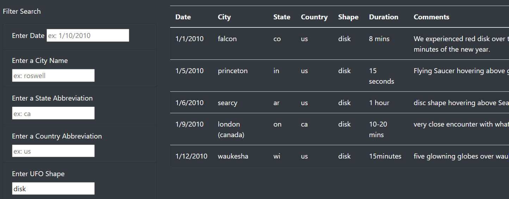
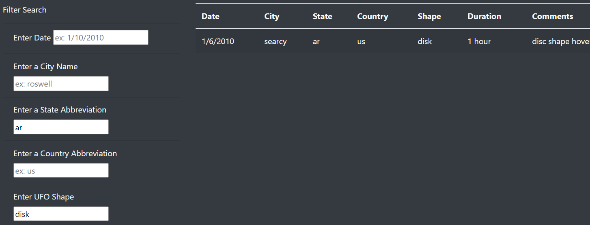

# UFO Website Database Search

## Overview

Dana has a vested interest in tracking UFO sightings, firmly believing we're not alone out there. Previously, we helped Dana set up a website to host a small database of sightings. We introduce the reader to current thoughts and happenings from various prominent ufologists and invite them to explore sightings from fellow citizen-scientists.  

The database of sightings could be filtered on the sighting date. Dana has asked us to update the site so that there are more filter options, including city, state, country, and shape of sightings, and that users are no longer required to press a button to update the fitered results.

## Results  

The website now has the added functionality of the expanded filtering options. For example, if a fellow citizen saw a disk-like object, they could filter the results using the 'shape' option to see what other observations there were.  
  

The user can see the number of other sightings of disk-shaped UFOs simply after hitting 'enter' (or clicking anywhere on the page).  

If the user is also, for example, from Arkansas, they can further filter the results by including their state abbreviation,  
  

As can be seen, with just our two filter results, we have narrowed down the number of other sightings in our database to just 1. Our imaginary user is now free to make whatever conclusions they'd like comparing their sighting to the previous sighting on the 6th of January.  

## Summary  

The new site works very well. Of course, that doesn't mean there can't be improvements. For example, there is a drawback to the new site. Removing the 'update filters' button means that a user can't filter on multiple results at once. One has to update the filters one at a time. With a small database to load, as is the current case, this isn't a large problem. As the data grows larger, though, it becomes cumbersome to wait for each update to finish. Adding the button back would enable a user to enter more than one filter option for one update.

As well, future ideas for improving search options include partial city matching, enabling one to search for, e.g., 'louis' for 'st. louis' or 'cajon' for 'el cajon'. Additionally, the date filter option currently works to filter to only the date searched. Incorporating a range value for the date searches would enable users to search over a range of dates rather than a single date.  

Currently, the only two database fields that don't have a search functionality are the duration and comments fields. While the comments fields would be hard to create a filter function for, creating one for the duration field would be possible. Indeed, a range feature for the duration, as just discussed for the date feature, would be ideal. However, this would be a complex undertaking: either the filter function would have to incorporate language processing (e.g. "minute" and "hour") or the database would need to be cleaned so each entry is of a single unit. As it stands, the website is in great form and readily accessible for any citizen ufologists.  
